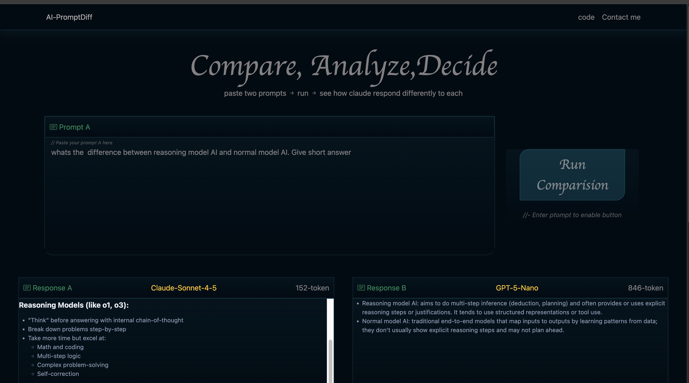

# AI Prompt Diff

A side-by-side AI prompt comparison tool that lets you see how differently Claude responds to two prompts. Compare responses, analyse metrics, and understand what makes a prompt more effective.

## Table of contents

1. [Screenshots](#screenshots)
2. [Features](#features)
3. [Techstack](#tech-stack)
4. [Getting Started](#getting-started)
5. [How to Use ](#how-to-use)
6. [Metrics-explained](#metrics-explained)
7. [Eniviroment Variables](#enviroments-variables)
8. [Project Structure](#project-structure)
9. [Author](#author)
10. [License](#license)

## Screenshots



---

## Features

- **Side-by-side comparison** — send one prompt to both Claude Sonnet and GPT-5 Nano simultaneously
- **Metrics analysis** — compare Length, Clarity, and Response Speed for each model
- **Key Differences** — AI-generated summary of the 3 main differences between responses
- **Token count** — see how many tokens each model used per response
- **Prompt History** — track all prompts tested in the current session
- **Clean dark UI** — built with a dark theme for readability

---

## Tech Stack

**Frontend**

- React (Vite)
- Bootstrap 5
- CSS3

  **Backend**

- Node.js
- Express
- Anthropic API (Claude Sonnet 4.5)
- Gpt -5 Nano API (open AI)

---

## Getting started

### Prerequisites

- Node.js v20+
- Yarn
- Anthropic API key — [get one here](https://console.anthropic.com)
- OpenAI API key -[get one here](https://platform.openai.com/api-keys)

### Installation

1. Clone the repo

```bash
git clone https://github.com/https://github.com/bguragain1023-web/AI-Prompt-Diff
cd AI-prompt-diff
```

2. Install dependencies

```bash
yarn
```

3. Create a `.env` file in the root folder

```
ANTHROPIC_API_KEY=your_api_key_here
OPENAI_API_KEY=your_api_key_here
```

4. Start the Express server

```bash
node --env-file=.env server.js
```

5. Start the frontend in a new terminal

```bash
yarn dev
```

6. Open your browser at `http://localhost:5173`

---

## How to Use

1. Type or paste a prompt in the **Prompt** box
2. Click **Run Comparison**
3. View both responses side by side with different AI model
4. Check the metrics and key differences below

---

## Metrics Explained

| Metric      | What it measures                                 |
| ----------- | ------------------------------------------------ |
| **Length**  | Word count of the response                       |
| **Clarity** | Average words per sentence — shorter = clearer   |
| **Speed**   | How long the API took to respond in milliseconds |

---

## Environment Variables

| Variable            | Description            |
| ------------------- | ---------------------- |
| `ANTHROPIC_API_KEY` | Your Anthropic API key |
| `OPENAI_API_KEY`    | Your OpenAI API key    |

---

## Project Structure

```
AI-prompt-diff/
..
├── README.md
├── api
│   ├── compare.js
│   └── gpt-5.js
├── index.html
├── package.json
├── public
├── server.js
├── src
│   ├── App.css
│   ├── App.jsx
│   ├── assets
│   │   ├── prompt.PNG
│   │   └── response.PNG
│   ├── components
│   │   ├── Compare.jsx
│   │   ├── Detail.jsx
│   │   ├── Footer.jsx
│   │   ├── Hero.jsx
│   │   ├── History.jsx
│   │   ├── Input.jsx
│   │   ├── Metrics.jsx
│   │   └── Navbar.jsx
│   ├── index.css
│   ├── main.jsx
│   └── utils
│       ├── api.js
│       └── metric.js
```

---

## Author

**Brazesh Guragain**

- GitHub: [bguragain1023-web](https://github.com/bguragain1023-web)
- LinkedIn: [brazesh-guragain-32a6661b0](https://linkedin.com/in/brazesh-guragain-32a6661b0/)
- Portfolio: [Brazesh Guragain](https://brazeshguragain.com)

---

## License

MIT License — feel free to use this project as inspiration for your own.
